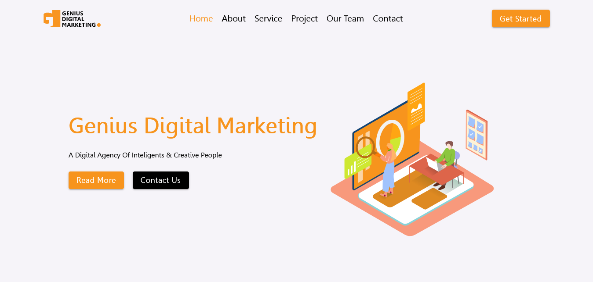

# GDM - CMS Application.

## Table of contents

- [Overview](#overview)
  - [Screenshot](#screenshot)
  - [Links](#links)
- [My process](#my-process)
  - [Built with](#built-with)
  - [Useful resources](#useful-resources)
- [Author](#author)

## Overview

### Screenshot

### Links

- Live Site URL: [GDM](https://genius-digital-marketing.vercel.app/)

## My process

### Built with

- [React.JS](https://react.dev/)
- [MUI](https://mui.com/)
- [Styled Components](https://styled-components.com/)
- [Framer Motion](https://www.framer.com/motion/)
- [Strapi](https://strapi.io/)

### Useful resources

- [Deploying MySQL to Free Sql Database](https://www.freesqldatabase.com/)

## Author

- Portfolio - [Shaher Ashraf](https://thegoat7.netlify.app/)
- LinkedIn - [Shaher Ashraf](https://www.linkedin.com/in/shaher88223/)
